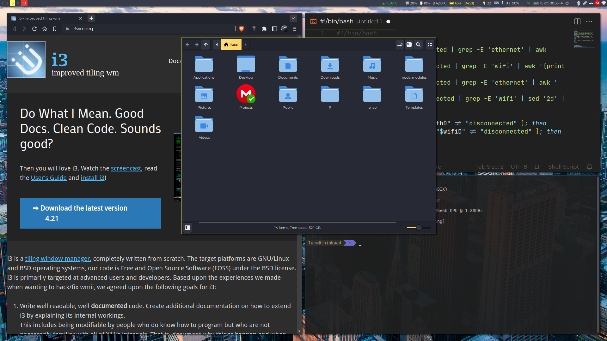

# i3u

i3 window manager custom configuration with some script to customize Debian and its derivatives

## Usage

Check files into `.config` directory to add own customizations. Then you can run `install` script to automatically install everything. You can also run `apps_install` to install some applications that I prefer.

## [Shortcuts](shortcuts.md)